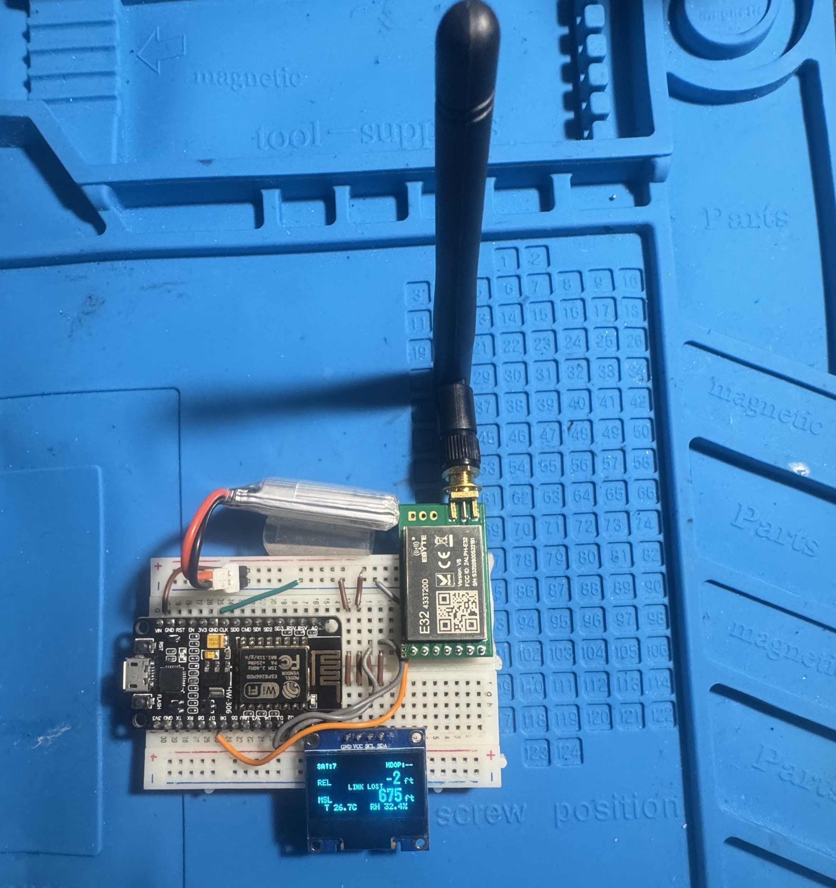
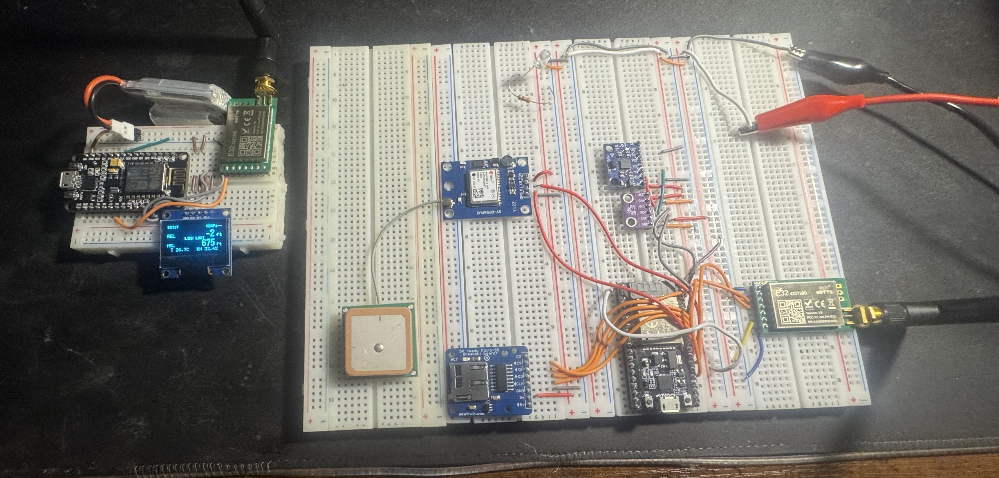
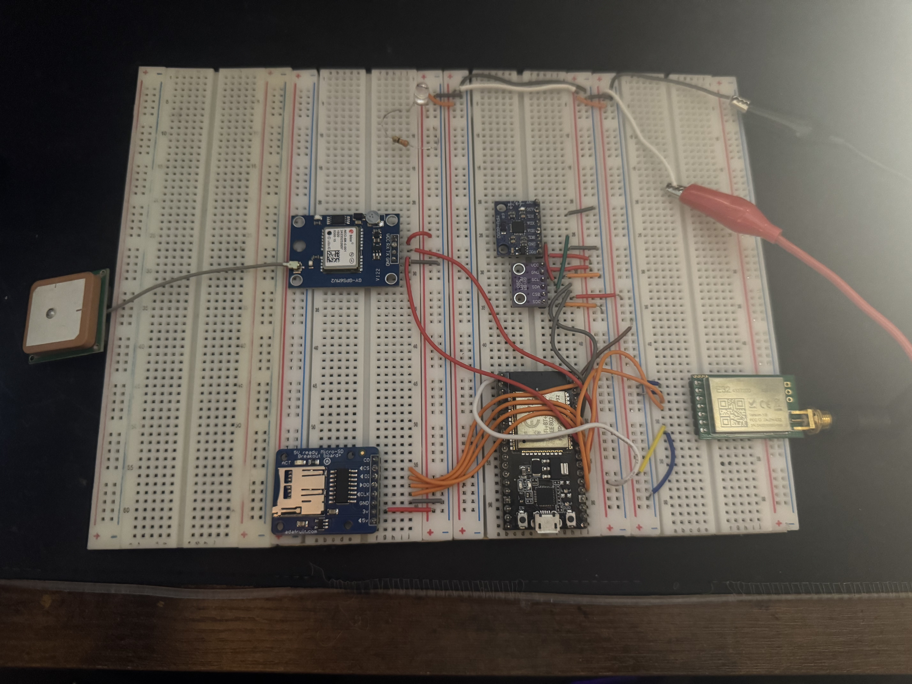

# Rocket Telemetry System (ESP32 + LoRa)

<p align="center">
  
  <br/><br/>
  
  
  <br/>
  <em>Flight computer and ground station telemetry project</em>
</p>

## Overview

This repository contains the firmware and project media for a **rocket telemetry system** built around an onboard **flight computer** and a separate **ground station**.

The system is designed to stream live sensor data over **LoRa** during flight while also logging telemetry to **microSD** for post-flight analysis. The goal is to maintain a live downlink during operation while preserving onboard data if radio communication drops or packets are lost.

This project focuses on the hardware/software boundary in embedded systems: combining sensing, packetized communication, logging, and ground-side monitoring into one telemetry pipeline.

---

## Features

- Live telemetry downlink using **LoRa**
- Onboard **microSD logging**
- Modular sensor architecture
- Separate **flight system** and **ground station**
- Packetized telemetry protocol designed for extension
- Serial ground-station output for use with dashboards or logging tools

---

## System Overview

### Flight Computer
- ESP32-based onboard system
- Interfaces with sensors, LoRa radio, and microSD storage
- Collects telemetry at a fixed update rate
- Transmits packets to the ground station
- Logs data locally to SD for recovery and post-flight review

### Ground Station
- LoRa receiver built around an ESP32 or Arduino-class board
- Receives and decodes telemetry packets
- Outputs live telemetry over Serial
- Can be connected to a laptop dashboard or logging interface

---

## Repository Layout

```text
.
├── README.md
├── firmware/
│   ├── flight_system/
│   │   └── flight_system_2_0.ino
│   └── ground_station/
│       └── ground_station_2_0.ino
├── media/
│   └── images/
│       ├── rocket_build.jpeg
│       ├── rocket_cover_1.jpeg
│       └── rocket_cover_2.jpeg
└── tools/
    └── repo_maintenance/
        └── telemetry_rocket_repo_audit.py
